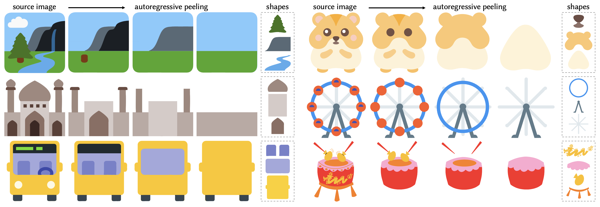

# LayerPeeler: Autoregressive Peeling for Layer-wise Image Vectorization

[](https://arxiv.org/abs/2505.23740)
[](https://layerpeeler.github.io/)



## Overview

LayerPeeler is a framework for layer-wise image vectorization that decomposes images into structured vector representations. The system uses a vision-language model (VLM) to analyze an input image and construct a hierarchical layer graph by identifying topmost visual elements. These detected elements are then passed to a fine-tuned image diffusion model, which generates clean background images with the specified elements removed. This process enables precise, layer-by-layer vectorization.

## Updates
- [x] **[2025.12.11]**: Dataset Released
- [x] **[2025.12.11]**: Training Code Released 
- [x] **[2025.12.14]**: Inference Code Released
- [x] **[2025.12.29]**: Vectorization Code Released

## Setup

### 1. Environment Setup
```shell
conda create -n layerpeeler python=3.10
conda activate layerpeeler

pip install torch==2.5.1 torchvision==0.20.1 torchaudio==2.5.1 --index-url https://download.pytorch.org/whl/cu124
pip install -r requirements.txt
````

### 2. Merge the Pretrained Model

As described in the paper, we use a pretrained LoRA model trained on the `SeedEdit` dataset. Before training or inference, you must merge this LoRA checkpoint with the base model.

```bash
python merge_pretrain.py
```

> [!TIP]
> You can update the path to the pretrained model inside `merge_pretrain.py` if needed.

## Inference

The inference code is located in the [`inference`](./inference) directory.

### 1. Gemini API Setup

> [!CAUTION]
> Gemini is not accessible in Hong Kong. Therefore, we use a third-party API from [V-API](https://api.v3.cm/) to forward requests to Gemini. If you are in a region with direct access to Gemini, you can modify the `BASE_URL` (line 26) in `inference/utils/vlm_util.py` to use the official Gemini API. Additional changes may be required. We apologize for the inconvenience.

Paste your Gemini API key into the `.env` file:

```shell
GEMINI_API_KEY=<your_key>
```

### 2. Test Set

We provide a test set containing 250 images (with corresponding ground-truth SVG files) in the [`data`](./data) directory. The inference script processes all images in this set.

### 3. Inference Scripts

Run the inference script **without attention control**:

```bash
cd inference
bash inference.sh
```

If you have full access to Gemini, you can run the inference script **with attention control**:

```bash
bash inference_attn.sh
```

> [!IMPORTANT]
>
> 1. **LoRA Weights**: The LoRA weights are hosted on Hugging Face: [LayerPeeler](https://huggingface.co/kingno/LayerPeeler/tree/main). They will be downloaded automatically during inference.
> 2. **Attention Control**: When using V-API to access Gemini, we found bounding box and mask detection to be unstable. As a result, `inference.sh` does not use the attention control mechanism described in the paper.
> 3. **Output**: Results are saved in the `outputs` directory, including the VLM responses, layer graphs, and generated images in their respective subdirectories.
> 4. **VLM Model**: We use Gemini 2.5 Pro for VLM reasoning because it provides reliable mask and bounding box detection. If attention control is disabled, other VLM models may also be suitable.

### 4. Limitations

For complex input images (e.g., those with multiple top layers to remove), the inference script may fail to produce the desired output. In such cases, trying different random seeds and inference steps may help.

## Vectorization

### 1. Recraft API Setup

We use [Recraft](https://www.recraft.ai/ai-image-vectorizer) to vectorize the visual differences between layered PNGs and merge them into a final SVG.
We chose Recraft because it offers superior accuracy and stability compared to other vectorizers.
**Note:** This API is not free. You must sign up for an account to obtain an API key.

Add your Recraft API key to the `.env` file:

```shell
RECRAFT_API_KEY=<your_key>
```

### 2. Vectorization Scripts

The vectorization code is located in the [`inference`](./inference) directory.

```bash
cd inference
python vectorize.py --base_dir outputs/testset
```

This command processes all subfolders within `base_dir`. For each folder, it calculates the difference between consecutive layer PNGs (isolating the object removed in each step), vectorizes these differences, and merges them into a final combined SVG.

> [!IMPORTANT]
> **Tuning Extraction Parameters**
>
> 1. **Morphological Opening (`--morph_kernel_size`)**
>    Since the image "before removal" and "after removal" are not guaranteed to be perfectly pixel-aligned, we use morphological opening to clean up small noise artifacts.
>
> 2. **Difference Threshold (`--diff_threshold`)**
>    You may need to adjust this if the layer being removed has a color very similar to the background. A higher threshold reduces noise but might miss faint details.

## Training

The training code and dataset are available in the [`train`](./train) directory. Detailed training instructions can be found in the corresponding [`README`](./train/README.md).